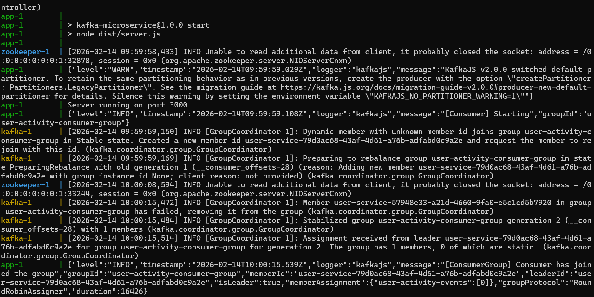
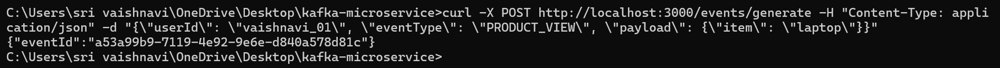
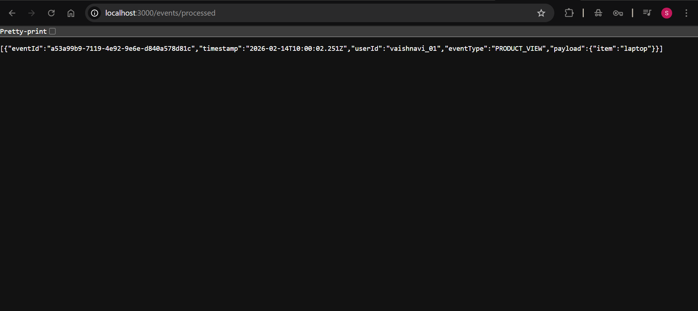

# Project: Kafka Microservice
**Author:** Sri Vaishnavi

A foundational microservice implementing the Producer-Consumer pattern using Apache Kafka and Node.js.

## Features
- **Idempotent Consumer**: Prevents duplicate processing of the same Event ID.
- **REST API**: For generating and querying events.
- **Dockerized**: Entire stack (Zookeeper, Kafka, App) runs with one command.

## How to Run
1. Run `docker-compose up --build`.
2. Wait for `Server running on port 3000`.

## How to Verify
- **Produce an Event:** Use `curl -X POST http://localhost:3000/events/generate -H "Content-Type: application/json" -d "{\"userId\": \"user1\", \"eventType\": \"LOGIN\"}"`
- **Consume/Query:** Use `curl http://localhost:3000/events/processed`

## Idempotency Logic
The consumer uses a `Set` to store `eventId`s. If an event with an existing ID arrives, it is logged as a duplicate and ignored, satisfying the requirement for resilient distributed messaging.

### System Verification

